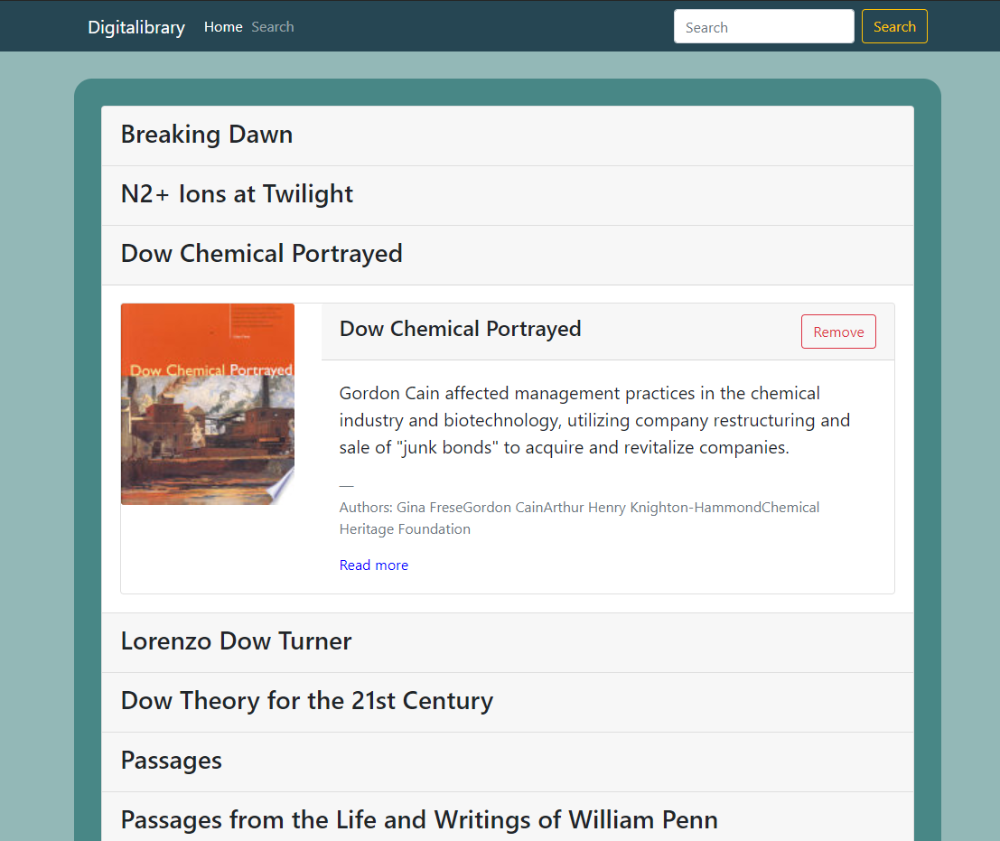
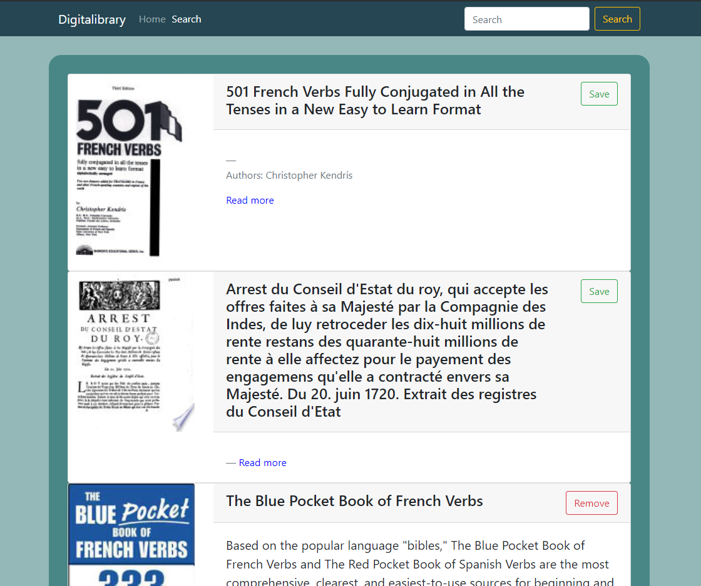

# Digitalibrary

## Table of content
* [About](#about-the-project)
* [Usage](#usage)
  * [Installation](#Installation)
  * [How to use?](#how-to-use)
* [Built with](#built-with)
* [Acknowledgements](#Acknowledgements)
* [Contact me](#contact-me)
## About the project
Full stack MERN application for searching books using google books api and saving selected results to database. 
## Usage  
### Installation   
Application is deployed on heroku, no installation needed.
<!-- Heroku link: [https://digitalibrary1.herokuapp.com/](https://digitalibrary1.herokuapp.com/).     -->
The repo with code on github: [https://github.com/PavN93/Digitalibrary.git](https://github.com/PavN93/Digitalibrary.git).
### How to use?    
Home page shows the users saved books library in a convenient clickable list that will unfold and show more details on mouse click. Delete button will remove the book from database.    
    
Search page is the place where the user can search for books and save results to database.    
    
## Built with
* [Visual Studio Code](https://code.visualstudio.com/)
* [MongoDB](https://www.mongodb.com/)
* [Express js](https://expressjs.com/)
* [React](https://reactjs.org/)
* [Node.js](https://nodejs.org/en/)
* [React Bootstrap](https://react-bootstrap.netlify.app/)
* JavaScript
* HTML
* CSS
## Acknowledgements
* [W3Schools](https://www.w3schools.com/)
* [MDN web docs](https://developer.mozilla.org/en-US/)
* [StackOverflow](https://stackoverflow.com/)
## Contact me
Pawel Nawoj  
See my [GitHub Profile](https://github.com/PavN93)    
email: paweln993@gmail.com

